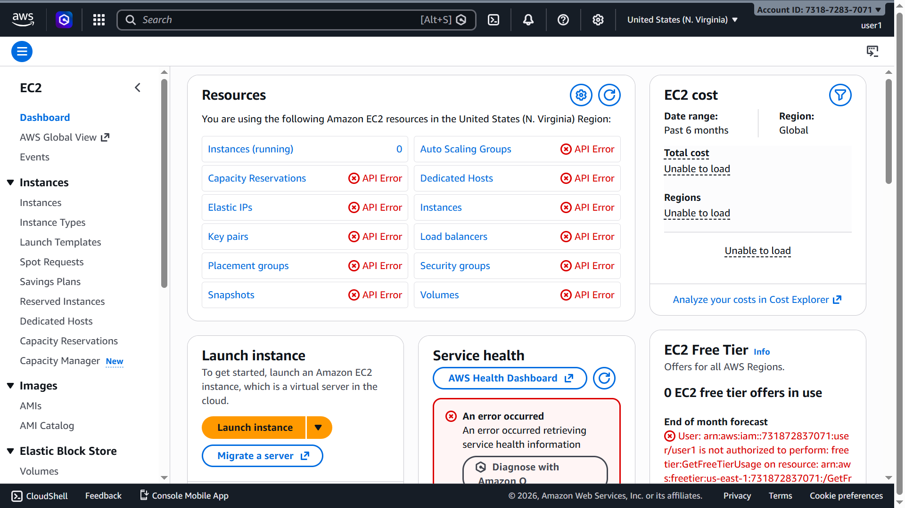
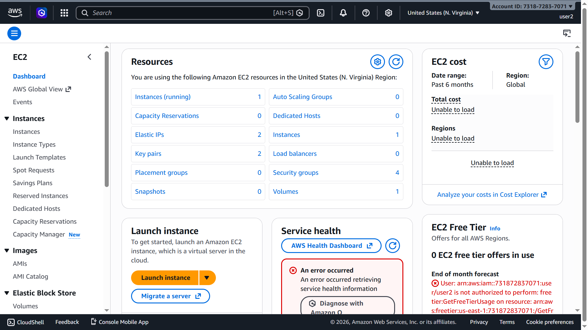

# NexGen — AWS S3 Static Website Hosting with Versioning & Lifecycle

> A premium SaaS-style landing page built with vanilla HTML, CSS, and JavaScript — deployed on **AWS S3** as a static website with versioning and lifecycle management, and also hosted on **AWS EC2** with Apache and secured via IAM access control.

---

## 🔗 Live Deployed Link (S3)

**[http://ankit-s3-static-website-2026.s3-website-us-east-1.amazonaws.com](http://ankit-s3-static-website-2026.s3-website-us-east-1.amazonaws.com)**

> Hosted on AWS S3 as a static website with versioning and lifecycle management enabled.

---

## 📌 Project Description

This project demonstrates end-to-end deployment of a static website on **AWS EC2** using the **Apache HTTP Server (httpd)**. It also covers **AWS IAM** configuration by creating two users with different permission levels to showcase access control best practices.

The website itself — **NexGen** — is a modern, high-converting SaaS landing page featuring:

- Deep Space Dark Theme with glassmorphism UI
- Animated ambient background orbs and scroll-triggered animations
- Sticky glassmorphism navigation header
- Live statistics counter (JavaScript `count-up`)
- Frontend email form validation
- Fully responsive layout (CSS Grid + Flexbox)

---

## 🛠️ Tech Stack

### Frontend
| Technology | Purpose |
|------------|---------|
| **HTML5** | Semantic page structure |
| **CSS3** | Custom properties, `@keyframes`, media queries, glassmorphism |
| **Vanilla JavaScript** | DOM manipulation, Intersection Observer, form validation |
| **Google Fonts** (`Outfit`, `Inter`) | Premium typography |
| **FontAwesome v6** | Icon library (CDN) |

### AWS Infrastructure
| Service | Usage |
|---------|-------|
| **EC2** (Amazon Linux 2023) | Virtual server to host the website |
| **Apache HTTP Server (httpd)** | Web server to serve static files over HTTP |
| **Elastic IP** | Static public IP (`54.173.124.70`) that persists across reboots |
| **Security Groups** | Firewall rules — allowed inbound HTTP (port 80) and SSH (port 22) |
| **IAM** | Identity & Access Management — two users with different permission levels |

---

## ⚙️ AWS Setup — Step-by-Step

### 1. Launch EC2 Instance
- Service: **EC2** → Launch Instance
- AMI: **Amazon Linux 2023**
- Instance Type: `t2.micro` (Free Tier eligible)
- Key Pair: Created and downloaded `.pem` file for SSH access
- Security Group: Opened ports **22 (SSH)** and **80 (HTTP)**

### 2. Connect via SSH (Windows CMD)
```bash
# Fix key permissions (Windows)
icacls "your-key.pem" /inheritance:r /grant:r "%USERNAME%:R"

# SSH into instance
ssh -i "your-key.pem" ec2-user@54.173.124.70
```

### 3. Install Apache & Deploy Website
```bash
# Update packages
sudo yum update -y

# Install Apache
sudo yum install httpd -y

# Start and enable Apache
sudo systemctl start httpd
sudo systemctl enable httpd

# Navigate to web root
cd /var/www/html

# Clone the repository
sudo git clone https://github.com/ankitgithub12/NexGen-Modern-Landing-Page.git .

# Set correct permissions
sudo chmod -R 755 /var/www/html
```

### 4. Allocate & Associate Elastic IP
- EC2 Console → **Elastic IPs** → Allocate Elastic IP
- Associate with the running EC2 instance
- Result: `54.173.124.70` (permanent public IP)

### 5. Configure IAM Users
- IAM Console → **Users** → Create two users with console access

---

## 👤 IAM Users & Permissions

| User | Policy Attached | Access Level |
|------|----------------|--------------|
| **User 1** | No EC2 policy | Cannot view or manage EC2 instances |
| **User 2** | `AmazonEC2FullAccess` | Full EC2 read/write/manage access |

> This demonstrates the **Principle of Least Privilege** — granting only the permissions each user actually needs.

---

## 📁 Project Structure

```
aws-project/
├── index.html          # Main page — Hero, Features, Stats, Pricing, Testimonials
├── styles.css          # Full design system — variables, animations, glassmorphism
├── script.js           # Scroll animations, hamburger menu, form validation, count-up
├── README.md           # Project documentation (this file)
└── images/
    ├── hero.png            # Hero section illustration
    ├── benefits.png        # Benefits/dashboard section image
    ├── avatar1.png         # Testimonial avatar — Sarah Jenks
    ├── avatar2.png         # Testimonial avatar — Mark Thompson
    ├── avatar3.png         # Testimonial avatar — Emily Chen
    ├── EC2 instance.png                              # AWS EC2 Console screenshot
    ├── user1.png                                     # IAM User 1 login screenshot
    ├── user2.png                                     # IAM User 2 login screenshot
    ├── S3 Bucket with uploaded files visible.png     # S3 bucket screenshot
    ├── Versioning view showing multiple versions of a file.png  # S3 versioning screenshot
    └── Lifecycle rule configuration.png              # S3 lifecycle rule screenshot
```

---

## 🌐 Website Sections

| Section | Description |
|---------|-------------|
| **Hero** | Headline, subheading, dual CTAs, floating hero image |
| **Logo Cloud** | Trusted brands strip (AWS, Docker, Slack, Figma, JS) |
| **Features** | 4-card grid — Lightning Fast, Security, Analytics, Integrations |
| **Stats** | Animated counters — 10,000+ Users, 99% Satisfaction, 24/7 Support |
| **Benefits** | Side-by-side layout — Automation, Collaboration, Reporting |
| **Testimonials** | 3-card testimonial grid with avatars |
| **Pricing** | 3-tier pricing — Basic ($19), Pro ($49), Enterprise ($99) |
| **Contact / CTA** | Email signup form with frontend validation |
| **Footer** | Brand, Product, Company, Legal columns + social links |

---

## 📸 Screenshots

### ☁️ EC2 Instance — AWS Console


---

### 👤 User 1 — IAM Login (Restricted Access)


---

### 👤 User 2 — IAM Login (Full EC2 Access)


---

## ⚠️ Challenges Faced & How They Were Resolved

| # | Challenge | Resolution |
|---|-----------|------------|
| 1 | **SSH `.pem` permission error on Windows** — Windows doesn't apply Unix-style file permissions, so SSH rejected the key with an "Unprotected private key file" error. | Used `icacls` in CMD to remove inherited permissions and grant access only to the current user. |
| 2 | **Connection issues in Windows CMD** — SSH was not recognized as a command in older Windows setups. | Enabled the **OpenSSH Client** feature via Windows Settings → Optional Features. |
| 3 | **File permission errors on EC2** — Cloning the repo directly to `/var/www/html` failed due to root-only write permissions. | Used `sudo` for all commands and ran `chmod -R 755` to fix directory permissions. |
| 4 | **Region mismatch in IAM user login** — IAM users could not see EC2 instances because they were accessing a different AWS region than where the instance was launched. | Ensured both the root account and IAM users were using the **same region** (e.g., `us-east-1`) in the AWS Console. |
| 5 | **Elastic IP not routing traffic** — After associating the EIP, HTTP requests were timing out. | Verified the Security Group had an inbound rule for **HTTP port 80** from `0.0.0.0/0`, which was initially missing. |

---

## 🚀 How to Run Locally

No build tools or Node.js required.

```bash
# Clone the repo
git clone https://github.com/ankitgithub12/NexGen-Modern-Landing-Page.git

# Open in browser
# Simply open index.html in any modern browser (Chrome, Firefox, Edge)
```

---

## ☁️ AWS S3 Static Website Hosting Assignment

### 👤 Student Details

| Field | Details |
|-------|---------|
| **Name** | Ankit Kumar |
| **Registration Number** | 12318541 |
| **Deployed Website Link (S3 URL)** | [http://ankit-s3-static-website-2026.s3-website-us-east-1.amazonaws.com](http://ankit-s3-static-website-2026.s3-website-us-east-1.amazonaws.com) |

---

### 🪣 S3 Setup — Step-by-Step

1. **Create S3 Bucket** — Named `ankit-s3-static-website-2026` in `us-east-1` region
2. **Disable Block Public Access** — Unchecked all "Block Public Access" settings
3. **Enable Static Website Hosting** — Set `index.html` as the index document
4. **Add Bucket Policy** — Allowed public `s3:GetObject` access via JSON policy
5. **Upload Files** — Uploaded `index.html`, `styles.css`, `script.js`, and the `images/` folder
6. **Enable Versioning** — Turned on S3 Versioning to track multiple file versions
7. **Configure Lifecycle Rule** — Created a rule to transition/expire older object versions automatically

---

### 📸 S3 Screenshots

#### 🪣 S3 Bucket — Uploaded Files Visible


---

#### 🔁 Versioning View — Multiple Versions of a File


---

#### ♻️ Lifecycle Rule Configuration


---

### ⚠️ S3 Challenges Faced & How They Were Resolved

| # | Challenge | Resolution |
|---|-----------|------------|
| 1 | **403 Forbidden error after enabling static website hosting** — The website returned a 403 even after enabling static hosting. | Disabled **Block Public Access** on the bucket and added a bucket policy granting `s3:GetObject` to `"*"`. |
| 2 | **CSS and JS files not loading (404)** — Only `index.html` loaded; stylesheets and scripts returned 404. | Ensured all files (`styles.css`, `script.js`, and the entire `images/` folder) were individually uploaded and publicly accessible in the bucket. |
| 3 | **Versioning not visible initially** — After enabling versioning and re-uploading files, old versions were not shown. | Toggled the **"Show versions"** switch in the S3 console to reveal all stored versions of each object. |
| 4 | **Lifecycle rule not applying** — The lifecycle rule was created but appeared inactive. | Verified that the rule scope was set to **"Apply to all objects in the bucket"** and that versioning was enabled (a prerequisite for version-expiry rules). |
| 5 | **Images not rendering on S3-hosted site** — Some images failed to load due to case-sensitive file path mismatches. | Ensured all image filenames and paths in `index.html` exactly matched the uploaded file names in S3 (S3 keys are case-sensitive). |

---

*Built and deployed by Ankit Kumar (Reg: 12318541) | Hosted on AWS S3 & EC2*
